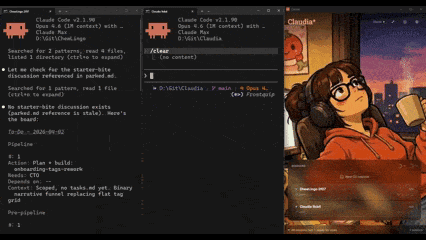

# Claudia

**Your Claude keeper.**

**Claud**e + d**ía** — Claude Code every day!

<p align="center">
  
</p>

## Why

Claude Code had me running — different monitors, different terminals, different projects. I kept tab-switching: *is it done? Is it blocked? Which terminal was that?*

So here comes Claudia — built with Claude, under Claudia's watch?! It watches them all in one tab and dings when something needs me.

And honestly, who doesn't like some company?

## Quick Start

```bash
npx @rockyhong/claudia
```

First run prompts you to install hooks. That's it — run your Claude sessions and Claudia picks them up.

> Already-running sessions won't see the hooks. Restart them after installing.

### Desktop App

Prefer a standalone window? Grab the latest from [Releases](https://github.com/RockyHong/Claudia/releases) — no Node.js required.

- **Windows** — `Claudia-Windows.zip` (extract and run)
- **macOS** — `Claudia.dmg` (drag to Applications)

## How It Works

```
Terminal 1 (claude code)  ──┐
Terminal 2 (claude code)  ──┤ hooks (curl POST)
Terminal 3 (claude code)  ──┘
                            ▼
              Claudia server (localhost:48901)
                            │
                            │ SSE stream
                            ▼
                    Browser dashboard
```

Claude Code [hooks](https://docs.anthropic.com/en/docs/claude-code/hooks) fire on session events, sending a small JSON payload to Claudia's local server. It tracks state transitions and pushes updates to your browser via Server-Sent Events.

## Features

- **All sessions, one view** — no more tab-switching to check what's done, blocked, or waiting
- **Spawn** — launch project terminals, Claude sessions, open project folders — without leaving the dashboard
- **Project docs** — browse the markdown tree per project — specs, READMEs, scope at a glance
- **Focus** — notifications tell you when something needs you, terminal jump gets you there
- **Avatar** — video sets that react to what's happening — custom sets, import/export

## Privacy

All access is local. The only network call is the opt-in Anthropic usage API.

See [docs/help/privacy.md](docs/help/privacy.md) for exactly what Claudia reads, and how to remove every trace.

## Commands

```bash
claudia              # start the server, open the dashboard
claudia md           # open the markdown viewer for the current directory
claudia shutdown     # stop the running instance
claudia uninstall    # remove hooks + delete all Claudia data
```

Install globally with `npm i -g @rockyhong/claudia`, or prefix any command with `npx @rockyhong/claudia`.

## Requirements

- Node.js 18+
- Claude Code (with hooks support)

## License

MIT
